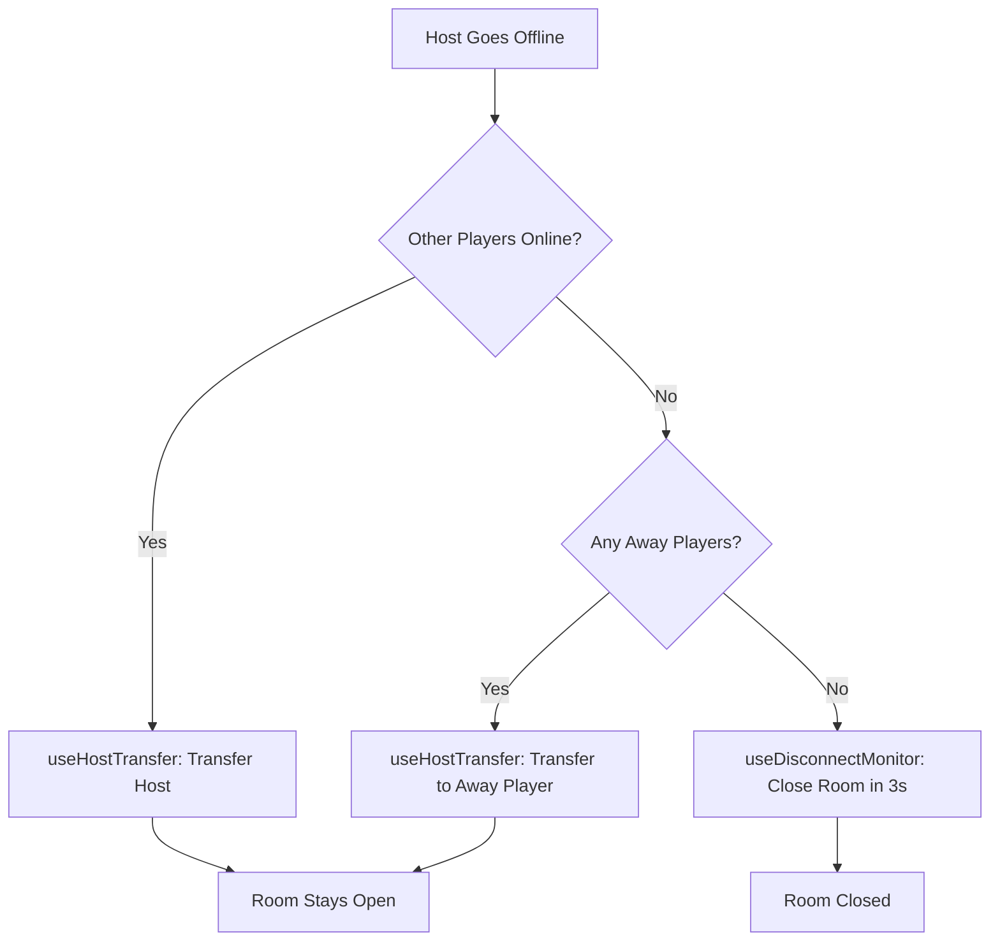

# Host Transfer & Room Closure Logic

## Overview

This document explains how host transfer and room closure work together to ensure rooms stay open when host leaves (if other players exist) and only close when ALL players are offline.

---

## Core Principles

### 1. Room Stays Open When Host Leaves (If Players Exist)

✅ **Host leaves + 1 or more players online/away** → Host transfers to another player, room stays open
❌ **ALL players offline** → Room closes after 3 seconds

### 2. Host Transfer Priority

When host goes offline, the system searches for a replacement:

1. **First**: Online players
2. **Second**: Away players
3. **Last**: If no one available, room closes

---

## How It Works

### Scenario 1: Host Leaves, Other Players Online

```
Initial State:
  Host: Alice 🟢 online
  Player: Bob 🟢 online
  Player: Charlie 🟢 online

Alice closes browser/leaves:
  Host: Alice ⚫ offline
  Player: Bob 🟢 online  ← Becomes new host
  Player: Charlie 🟢 online

Result:
  ✅ Room stays OPEN
  👑 Bob is now host
  🎉 Notification shown: "Bob is now the room host"
```

### Scenario 2: Host Leaves, Only Away Players

```
Initial State:
  Host: Alice 🟢 online
  Player: Bob 🟡 away (tab hidden)

Alice leaves:
  Host: Alice ⚫ offline
  Player: Bob 🟡 away  ← Becomes new host

Result:
  ✅ Room stays OPEN
  👑 Bob is now host (even though away)
```

### Scenario 3: All Players Offline

```
Initial State:
  Host: Alice 🟢 online
  Player: Bob 🟢 online

Both leave/disconnect:
  Host: Alice ⚫ offline
  Player: Bob ⚫ offline

Result:
  ❌ Room closes after 3 seconds
  📢 "Auto-closed: All players disconnected"
```

---

## Technical Implementation

### Components Involved

| Component | Purpose |
|-----------|---------|
| `useHostTransfer` | Monitors host status, triggers transfer when host goes offline |
| `useDisconnectMonitor` | Monitors ALL players, closes room only if ALL offline |
| `transferHost()` | Performs the actual host role transfer in Firebase |
| `ROOM_MONITOR_CONFIG` | Configuration (3-second timeout for empty rooms) |

### Execution Flow



### Code Coordination

**File: `src/hooks/useHostTransfer.js`**
- Listens for host going offline
- Finds eligible replacement (online > away)
- Transfers host role in Firebase
- Shows notification

**File: `src/hooks/useDisconnectMonitor.js`**
- Listens for ANY player disconnect
- Checks if ALL players are offline
- Only closes if `onlineCount === 0 && awayCount === 0`
- Waits 3 seconds before closing

**File: `src/services/room.js`**
- `transferHost(roomId, currentHostId)` function
- Updates Firebase: `members/{newHostId}/role = 'host'`

---

## Configuration

**File: `src/config/roomMonitor.js`**

```javascript
EMPTY_AUTO_CLOSE_TIMEOUT: 3 * 1000  // Close empty rooms after 3 seconds
```

To change the timeout, edit this value.

---

## Edge Cases Handled

### ✅ Multiple Players Leave Simultaneously
- System counts remaining online/away players
- Transfers host if any remain
- Only closes if ALL offline

### ✅ Host Leaves, Reconnects Quickly
- New host is already assigned
- Old host becomes regular player
- Room never closes

### ✅ Last Online Player Leaves (Away Players Remain)
- Room stays open
- Away player becomes host
- Room continues normally

### ✅ Network Interruption
- Firebase disconnect handlers trigger
- Host transfer occurs automatically
- Room only closes if everyone disconnects

---

## Testing Checklist

### Test 1: Host Leaves with 2+ Players
```
Setup:
  - Host creates room
  - 2+ players join
  - All players online

Action:
  - Host closes browser/tab

Expected:
  ✅ Room stays open
  ✅ Second player becomes host
  ✅ Notification appears: "Player X is now the room host"
  ✅ Other players see the notification
```

### Test 2: All Players Leave
```
Setup:
  - Host creates room
  - 1+ players join

Action:
  - ALL players close browsers

Expected:
  ✅ Room closes after 3 seconds
  ✅ Room appears as "CLOSED" in lobby
  ✅ Room deleted after 30 seconds
```

### Test 3: Host Leaves, Only Away Players
```
Setup:
  - Host creates room
  - Player joins, switches to another tab (away)

Action:
  - Host closes browser

Expected:
  ✅ Room stays open
  ✅ Away player becomes host
  ✅ Notification shown
```

---

## Debugging

### Console Logs to Look For

**Host Transfer:**
```
👑 [transferHost] Starting host transfer for room ABC123
👑 [transferHost] Eligible players: 2
👑 [transferHost] Host transferred to: User eb6z (online)
```

**Disconnect Monitor:**
```
[DisconnectMonitor] Room ABC123 member count: {online: 1, away: 0, offline: 1}
[DisconnectMonitor] Room ABC123 still has active/away members, not closing
```

**When closing:**
```
[DisconnectMonitor] ALL 2 members offline! Room ABC123 will close in 3s
[DisconnectMonitor] Auto-closing empty room ABC123
```

---

## Summary

✅ **Room stays open when host leaves IF other players exist**
✅ **Host automatically transfers to next online player**
✅ **Room only closes when ALL players are offline**
✅ **Empty rooms close after 3 seconds**
✅ **Works even when browsers are completely closed**

This ensures a smooth multiplayer experience where rooms don't close prematurely!
